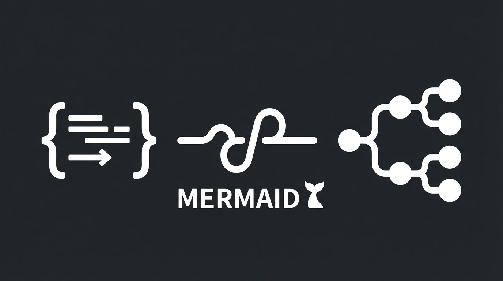

NotebookLMに最近追加された「マインドマップ（Studio機能）」、皆さんはどう使っていますか？
NotebookLMはGoogleが提供するAI学習アシスタントで、特に大量のドキュメントから情報を抽出し、関連性を整理するのに優れています。最近追加されたマインドマップ機能は、ソースから情報を自動で構造化し、視覚的に提示することで、複雑な概念の理解を助けるツールとして注目されています。
多くの人が、この機能を使い、資格試験の教科書や公式シラバスといった「完璧な情報源」を整理しようと考えるはずです。これは、膨大な知識を体系的にインプットし、全体像を把握したいという自然な欲求からくるものです。

しかし、実際にやってみると「AIが作った分類がしっくりこない」「そこは重要じゃないのに」と、モヤモヤした経験はありませんか？
AIが生成するマインドマップは、あくまで一般的な情報に基づいているため、個人の理解度や学習進捗に完全に合致するとは限りません。特にそう感じるのは、AIが客観的な情報を整理するのに対し、私たちの学習には主観的な理解度や苦手意識が大きく影響するからです。

実は、マインドマップ機能の真骨頂は、インプットの整理ではなく、<strong>アウトプット（試験結果）の分析</strong> にあります。資格試験において、自身の弱点を正確に把握し、それを効率的に克服することこそが合格への最短ルートとなるからです。
この記事では、自分の「脳内の思考の偏り」や「ミスの傾向��を客観的に可視化し、<strong>合格への最短ルートを描くための「弱点分析マップ」</strong> の具体的な作り方を紹介します。これにより、感情的な苦手意識ではなく、データに基づいた戦略的な学習計画を立てることが可能になります。

## 1. 教科書ではなく「自分のミス」をソースにする

AIに分析させるべきは、完璧なシラバスではなく、不完全な <strong>あなたの学習ログ</strong> です。なぜなら、AIは客観的な情報整理には長けていますが、あなたの個人的な理解のギャップや誤解のパターンを把握することはできません。あなたのミスこそが、AIが分析すべき最も価値のある「生データ」となるのです。

### 手順

1.  <strong>データの用意</strong>: 過去問演習で間違えた問題を、単なる正誤だけでなく、<strong>「どの分野の、どの概念で、なぜ間違えたのか」</strong> を簡潔に記録することが重要です。
    - 例: `2025春-問15: 不正解 (セキュリティ/ゼロトラスト/多要素認証と混同)`, `2024秋-問3: 不正解 (ネットワーク/OSI参照モデル/各層の役割の理解不足)`, `2023春-問20: 不正解 (データベース/正規化/第3正規化の概念が曖昧)`
    このように記録することで、AIは単なるキーワードの羅列ではなく、ミスに至った<strong>根本的な原因</strong>を特定しやすくなります。このデータは、日々の学習でメモ帳やスプレッドシートに記録しておくと良いでしょう。
2.  <strong>NotebookLMへの投入</strong>: この学習ログを、テキストファイルとしてNotebookLMのソースにアップロードします。一度に大量のログを投入してもAIが処理できますが、最初は直近の試験結果や特定の分野に絞って試してみるのも良いでしょう。このソースは、AIがあなたの弱点を分析するための「唯一の参考資料」となります。
3.  <strong>分析プロンプト</strong>: チャット欄で以下のように指示します。このプロンプトの���イントは、単なるキーワード抽出ではなく、<strong>「根本的な概念」「階層構造」</strong> を明確に指示している点です。

```markdown
アップロードした学習ログを分析し、私が頻繁に間違えている『根本的な概念』を抽出してください。
単なる用語リストではなく、どの分野の理解が欠けているために失点しているか、階層構造（カテゴリ > 原因 > 具体的な用語）で整理してください。
```

「根本的な概念」とは、例えば「OSI参照モデルの各層の具体的な機能」といった、より基礎的で広範な知識を指します。「階層構造」は、「ネットワーク」という大カテゴリの下に「OSI参照モデル」、さらにその下に「物理層の役割」といった形で、知識のつながりを整理させることで、どのレベルの理解が不足しているかを視覚的に把握しやすくします。

この状態でマインドマップを生成すると、教科書の目次ではなく、<strong>「あなたの脳内のバグ発生マップ」</strong> が可視化されます。
「ネットワーク」の枝が異常に太い、特定のジャンルだけ分岐が多い、といった視覚的なフィードバックは、あなたが意識していなかった潜在的な苦手分野や、特定の概念への理解が偏っていることを示唆します。これにより、<strong>「今、何を潰すべきか」</strong> が一目でわかります。このマップは、あなたの学習の優先順位を明確にし、無駄な学習時間を削減するための強力な羅針盤となるでしょう。

## 2. エンジニア向け裏技：Mermaid記法で出力する

NotebookLM標準のマインドマップ機能は視覚的な把握には優れていますが、生成後に内容を細かく編集したり、別の情報源と統合したりする自由度が低いのが難点です。
そこで、普段からVS CodeやObsidian、Notionといったマークダウンベースのエディタやノートツールを使っているエンジニアの皆さんには、<strong>Mermaid記法</strong>での出力が非常に有効です。

Mermaid記法とは、テキストベースでフローチャートやシーケンス図、そしてマインドマップのような図を記述できる軽量なマークアップ言語です。プログラミングの知識がなくても比較的簡単に習得でき、多くの開発ツールやドキュメントツールでサポートされています。

### プロンプト

```markdown
この弱点分析の結果を、Mermaid記法のマインドマップ形式でコードブロックに出力してください。
```

このプロンプトにより、AIが分析した結果が、そのままMermaid形式のテキストとして出力されます。
これを行えば、出力されたコードをコピーして、使い慣れたエディタ（Obsidian、Notion、VS CodeのMermaidプレビュー機能など）に貼り付けるだけで、動的なマインドマップとして表示・編集できるようになります。これにより、NotebookLMの外部で、より高度なカスタマイズが可能になります。



### なぜこれが最強なのか？

- <strong>編集可能</strong> : AIが生成したマインドマップはあくまで叩き台です。Mermaid記法で出力すれば、例えば「このミスは〇〇の参考書で補強する」「△△の動画で概念を再確認する」といった具体的な対策を、新たな枝として追記したり、既存のノードを修正したりできます。これは、試験対策において非常に重要な「行動計画」を立てる上で不可欠な機能です。
- <strong>自分だけの攻略本</strong> : AIが作った「他人のまとめ」ではなく、あなたが手を加え、自身の学習進捗や理解度に合わせて常に更新される「自分専用の戦略マップ」に育っていきます。実務においても、新しい技術を学ぶ際や、複雑なシステムを理解する際に、同様の手法で知識を整理・深化させることができます。これは、単なる資格取得にとどまらない、本質的な学習能力の向上に繋がります。

## まとめ：マインドマップ機能は弱点分析に使う

マインドマップ機能は、知識を詰め込むためではなく、<strong>自分の思考の癖を客観視する（メタ認知する）</strong> ために使いましょう。メタ認知とは、「自分自身の認知活動を客観的に捉え、評価し、コントロールする能力」のことです。資格試験においては、自分の得意・不得意、理解の浅い部分、勘違いしている概念などを正確に把握することが、効率的な学習戦略を立てる上で極めて重要になります。

- <strong>インプット整理</strong> : AIは一般的な知識を整理するのに優れていますが、個人の理解度や学習スタイルに合わせた調整は苦手なため、しっくりこないことが多いのが現状です。
- <strong>弱点分析</strong> : AIは感情を排して、あなたの学習ログという客観的なデータに基づいて、スコアアップの阻害要因を突きつけてくれる最強の参謀になります。この分析結果を元に、具体的な学習計画を立て、苦手分野を重点的に克服することで、最短での合格を目指すことができます。

AIに勉強させるのではなく、AIに「自分」を分析させる。この使い方が、あなたの学習を劇的に効率化し、最短合格への鍵となります。このスキルは、資格試験だけでなく、実務で新しい技術を習得する際や、問題解決のプロセスにおいても大いに役立つ、普遍的な学習アプローチとなるでしょう。