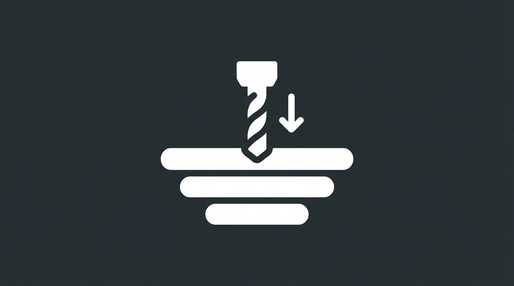

NotebookLMには、資料から自動的にクイズを作ってくれる「学習ガイド」機能があります。
ボタン一つで問題が出るので便利ですが、<strong>「全体からランダム」に出題されるため、実は効率があまり良くありません。</strong> IT資格試験の範囲は広大であり、ランダムな出題だけでは特定の苦手分野を克服したり、試験頻出の重要ポイントを効率的に深掘りしたりすることが難しいからです。

本気で試験に合格したいなら、AIを「ただの出題マシーン」ではなく、<strong>「あなたの弱点を知り尽くした専属コーチ」</strong> に進化させる必要があります。初学者が一人で広範な知識を網羅��、弱点を特定して克服するのは困難ですが、AIを適切に活用することで、まるで家庭教師がいるかのようにパーソナライズされた学習が可能になります。

この記事では、標準機能を卒業し、チャット機能を使った <strong>「弱点撲滅・パーソナライズクイズ戦略」</strong> を紹介します。この戦略は、試験合格に必要な深い理解と応用力を効率的に身につけるためのSyllabus Hack流アプローチです。

フェーズ1：弱点のあぶり出し（ショットガン方式）

まずは、AIにあなたの「理解度の穴」を見つけさせます。標準のクイズ機能よりも意地悪な、<strong>「ひっかけ問題」</strong> を作らせるのがポイントです。IT資格試験では、単純な知識の暗記だけでは通用しない、巧妙な選択肢や状況設定で受験者を惑わす問題が出題されることが多いため、こうした問題に慣れておくことは非常に重要です。

<strong>プロンプト:</strong>

```markdown
シラバスの全範囲から、あえて「間違いやすいひっかけ問題」を5問作成してください。
用語の単純な記憶ではなく、仕組みの理解を問う4択問題にして��ださい。
```

これを解いてみて、間違えた問題の「ジャンル（例：セキュリティ、計算問題）」をメモしておきましょう。なぜなら、IT資格試験では特定の分野に深く関連する問題が多く、自分の弱点分野を正確に把握することが、その後の効率的な学習計画を立てる上で不可欠だからです。これが、次に潰すべきターゲットになります。

フェーズ2：弱点特化の深掘り（ドリルダウン方式）

ここがパーソナライズ学習の真骨頂です。苦手な分野（例えば「公開鍵暗号」）が見つかったら、徹底的にそこだけを攻めるようAIに指示します。公開鍵暗号は、インターネットにおけるデータの安全なやり取りを支える非常に重要な技術であり、その仕組みを理解することは、セキュリティ分野の基盤となります。試験では、共通鍵暗号との違い、メリット・デメリット、具体的な応用例（デジタル署名、SSL/TLSなど）が頻繁に問われますし、実務ではセキュアなシステム設計において必須の知識です。

<strong>プロンプト:</strong>

```markdown
私は「公開鍵暗号」の仕組みが苦手なようです。このトピックだけに絞っ��、難易度を徐々に上げながら3問出題してください。

1問目は基本原理。
2問目は「共通鍵」との違いやメリット・デメリット。
3問目は実際の攻撃手法（中間者攻撃など）との関連。

一気に答えを出さず、1問ずつ出題して、私の回答を待ってから解説と次の問題を出してください。
```

この対話形式なら間違えた瞬間に、 <strong>「なぜ間違えたか」</strong> をその場で解説してもらえるため、理解の定着度が段違いです。単に正解・不正解を知るだけでなく、自分の思考プロセスのどこに誤りがあったのか、どの知識が不足していたのかを即座にフィードバックしてもらえるため、効率的に弱点を克服し、知識を深めることができます。



フェーズ3：逆クイズ（ファインマン・テクニック）

仕上げは、立場を逆転させます。あなたが先生役になり、AIに教えることで、<strong>「わかったつもり」</strong> を完全に排除します。これは「ファインマン・テクニック」として知られる学習法で、他者に説明することで自分の理解度を試すというものです。IT資格試験では、得た知識を単に覚えるだけでなく、それを自分の言葉で説明できるレベルまで昇華させることが求められます。

<strong>プロンプト:</strong>

```markdown
今度は君（AI）が生徒役になって、私に「公開鍵暗号」について質問してください。
私が先生として答えます。私の説明に論理的な飛躍や間違いがあれば、遠慮なくツッコミを入れてください。
```

AIからの鋭い質問に答えられなければ、そこがまだ理解できていない証拠です。ITの概念は複雑に絡み合っているため、一つの要素を説明するにも他の関連知識が必要になることがあります。AIは論理的な矛盾や説明不足を的確に指摘してくれるため、曖昧な理解のまま放置することなく、知識の穴を徹底的に埋めることができます。このアウトプットの練習を通じて、試験で問われる応用力や記述力も自然と鍛えられます。

まとめ：おすすめの運用サイクル

NotebookLMを使い倒す、最強のルーティンはこれです。

1.  <strong>朝（ウォーミングアップ）</strong> : 「学習ガイド」ボタンでランダムな5問をサクッと解く。これは、前日までの学習内容を軽く復習し、脳を学習モードに切り替えるのに最適です。幅広い範囲から出題されることで、知識の定着度を俯瞰的に確認できます。
2.  <strong>移動中（インプット）</strong> : 音声機能で解説を聞き流す。通勤・通学などのスキマ時間を有効活用し、苦手分野の解説や重要事項を耳からインプットすることで、多角的な学習を促進します。
3.  <strong>夜（ガチ演習）</strong> : チャットで「フェーズ2（弱点特化）」のプロンプトを打ち込み、弱点を徹底的に潰す。集中力が高まる夜の時間帯に、最も克服すべき課題に挑むことで、効率的に深い理解を得ることができます。

AIに受動的に従うのではなく、<strong>AIを能動的に使い倒す</strong>。これは、単に与えられた問題を解くだけでなく、自ら学習の方向性をデザインし、AIを強力な学習パートナーとして活用するということです。これこそが、Syllabus Hack流の学習スタイルであり、IT資格試験合格への最短ルートとなるでしょう。